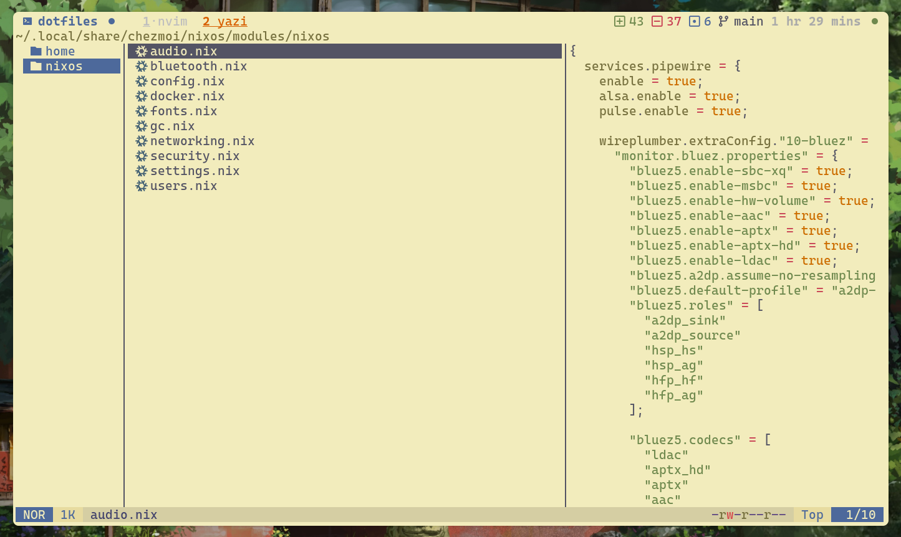

<div align="center">
  
</div>

<h3 align="center">
    Kanagawa Lotus Flavor for <a href="https://github.com/sxyazi/yazi">Yazi</a>
</h3>

## 👀 Preview



## 🎨 Installation

```bash
ya pack -a muratoffalex/kanagawa-lotus
```

## ⚙️ Usage

To set it as your light flavor, change the content of your theme.toml to:

```toml
[flavor]
light = "kanagawa-lotus"
```

## 📜 License

The flavor is MIT-licensed, and the included tmTheme is also MIT-licensed.

Check the [LICENSE](LICENSE) and [LICENSE-tmtheme](LICENSE-tmtheme) file for more details.
